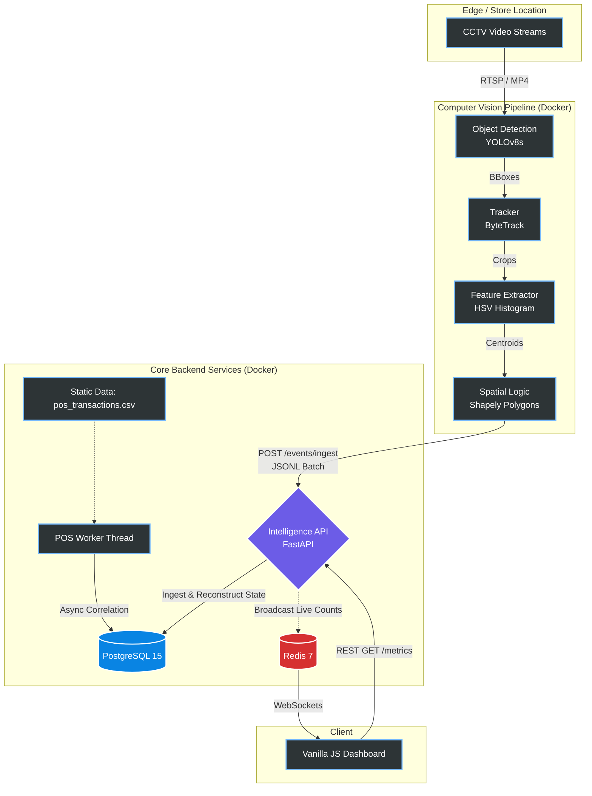
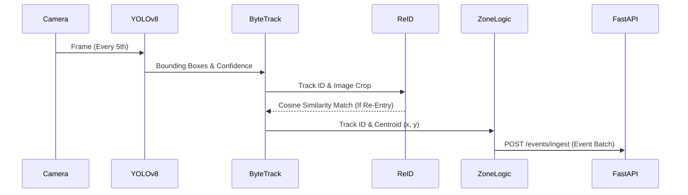
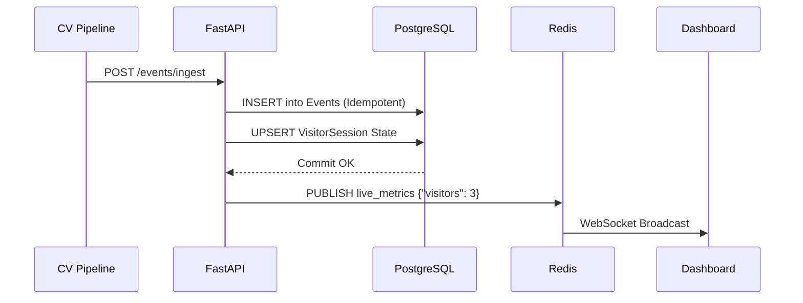
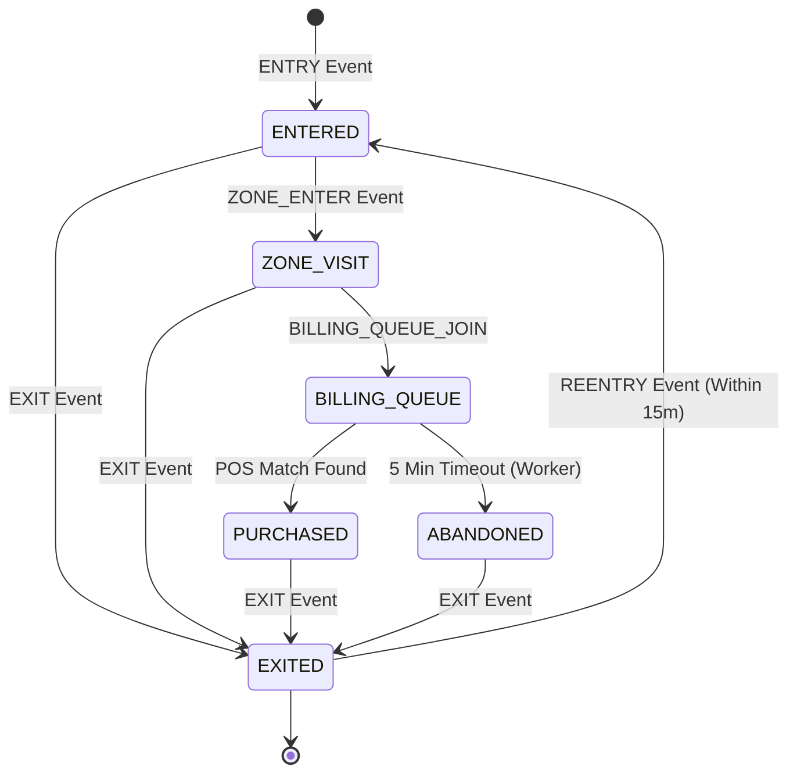

# System Architecture Documentation

**Project:** Purplle Tech Challenge 2026
**Store Focus:** Brigade Road, Bangalore (ST1008 / STORE_BLR_002)

---

## 1. High-Level System Overview
The Store Intelligence framework converts high-throughput raw CCTV streams into structured, queryable retail analytics. The platform is designed around a decoupled, event-driven microservices architecture that prioritizes resilience, asynchronous state reconstruction, and low latency.

---

## 2. Component Deep Dive

### 2.1 Computer Vision Pipeline (`pipeline/`)
The CV pipeline operates strictly within CPU environments to satisfy extreme scale constraints, operating completely free of GPU dependencies.

* **Detector (YOLOv8s):** Chosen for its balance of CPU inference speed and accuracy. By sampling only every 5th frame, we maintain high throughput while conserving CPU cycles.
* **Tracker (Supervision ByteTrack):** Solves the immediate occlusion problem. ByteTrack leverages Kalman filters to predict an object's trajectory when obscured by store shelves, retaining the unique tracking ID upon re-emergence.
* **Person Re-ID (HSV Histogram Fallback):** Rather than utilizing large deep-learning models (`torchreid`), which heavily bloat Docker images, the pipeline calculates a 96-dimensional Color Histogram from the HSV color space.
* **Spatial Logic (Shapely):** Parses `store_layout.json` to construct strict `Polygon` objects. Tracking centroids are tested against these spatial boundaries to emit precision `ZONE_ENTER` events.

### 2.2 The Intelligence Backend (`app/`)
The FastAPI application acts as the nerve center.

* **Ingest-Time Session Reconstruction:** Flat events are intercepted at `POST /events/ingest` and funneled through a strict state machine, live-updating the `visitor_sessions` PostgreSQL table.
* **Idempotency:** PostgreSQL uses `ON CONFLICT DO NOTHING` on the primary `event_id`. Re-pushed batches are safely ignored, preventing data corruption.

---

## 3. Data Flow & Metrics State Machine

Our North Star metric—Conversion Rate—depends on precise chronological session flows. 

By explicitly mapping user flows into states, our API endpoints like `GET /stores/{id}/metrics` achieve consistent sub-15ms response times. Instead of grouping thousands of raw events at runtime, we perform simple aggregations on pre-computed session states.
