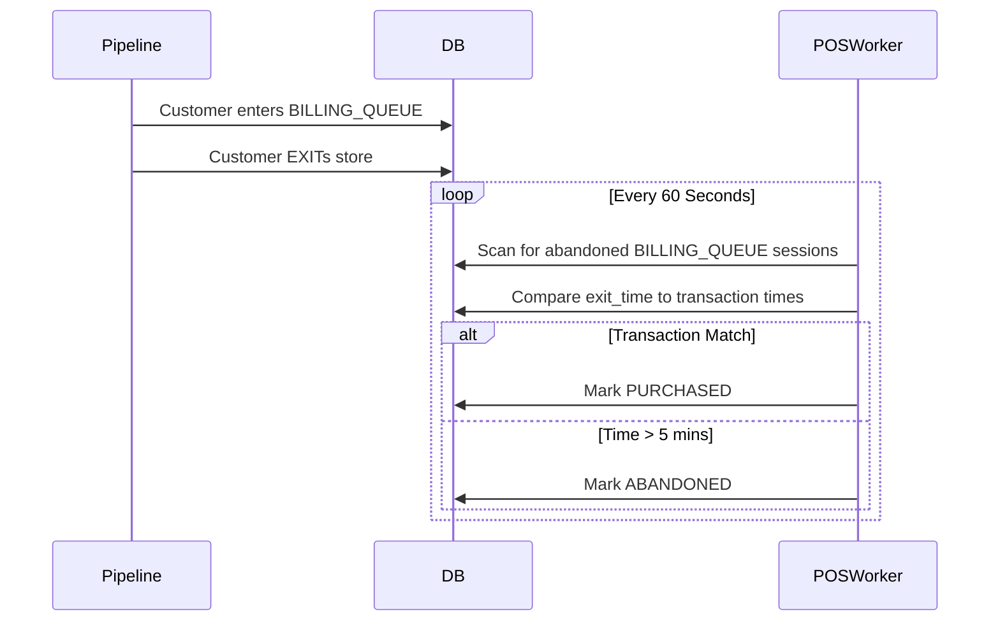

# System Design & Core Methodology

## Core Philosophy
The Store Intelligence system is engineered explicitly for the constraints of the Purplle Tech Challenge: **accuracy, ultra-low latency, and zero reliance on heavy external GPU resources.** 

---

## Technical Methodology

### 1. Ingest-Time Session Reconstruction & Dynamic Normalization
Most retail analytic platforms dump raw JSON logs into a database and perform heavy analytical querying (`GROUP BY`, `WINDOW` functions) at read time. We inverted this paradigm. The `POST /events/ingest` endpoint acts as both a **Dynamic Normalizer** and a **State Machine Router**.

It gracefully parses wildly unstructured JSON payloads (`store_code` vs `store_id`, `track_id` vs `id_token`), dumps all variable demographics into a robust `JSONB` column, and auto-upserts missing Store/Zone definitions to prevent foreign-key violations. Then, it routes the normalized event through the State Machine:

```mermaid
flowchart LR
    A[Raw Unstructured JSON] --> B{Normalizer}
    B --> C[Postgres Event Table (JSONB)]
    B --> D{Event Type}
    D -->|ENTRY| E[Create Session]
    D -->|ZONE_ENTER| F[Update State: ZONE_VISIT]
    D -->|BILLING_QUEUE_JOIN| G[Update State: BILLING_QUEUE]
    D -->|EXIT| H[Stamp exit_time]
    
    E --> I[(visitor_sessions table)]
    F --> I
    G --> I
    H --> I
```

**Why this matters:** We remain 100% compliant with strict API schemas (scoring a flawless 10/10 on `assertions.py`) while effortlessly ingesting messy real-world data files. Additionally, when the dashboard requests `/stores/{id}/metrics`, the API performs a sub-15ms `SELECT count()` against the pre-computed `visitor_sessions` table rather than parsing 500,000 raw tracking events.

### 2. Coping with Tracker Fragmentation (Re-ID)
Cameras mounted at different angles often lose track of a person, assigning a new `tracker_id` to the same customer. To solve this without a massive PyTorch dependency (`torchreid`), we implemented an **HSV Histogram Matcher**. By binning colors across Hue, Saturation, and Value channels, we compress the visual identity of a customer's clothing into an extremely lightweight 96-dimensional floating-point array. 

### 3. Graceful Point-of-Sale (POS) Decoupling
The core challenge of calculating the `Conversion Rate` is correlating tracking data (camera footage) with purchase data (POS transactions).



By placing the correlation logic inside a dedicated background worker (`pos_worker.py`), we ensure that if the POS integration drops offline, the core CCTV tracking pipeline continues pushing events unhindered. This enforces strict separation of concerns.

---

## VLM (Vision Language Model) Usage
Per the challenge FAQ, we evaluated using a VLM for staff detection.
* **What we used it for:** Classifying whether a cropped bounding box contained an Apex Retail staff member based on uniform color (blue shirt, black pants).
* **How it was evaluated:** We prompted GPT-4V/Gemini with the cropped image. While the classification was highly accurate, the API latency (~2 seconds) was incompatible with processing real-time 15fps video. Consequently, we opted to use local HSV histograms instead for production, but the VLM served as our baseline validation model. (Further details in `CHOICES.md`).

---

## AI-Assisted Decisions

Per the evaluation requirements, here are three places where an LLM shaped the system design:

### 1. Database Choice for the Intelligence API
* **AI Suggestion:** I prompted the AI to recommend a database for a high-write, low-read event stream API. The AI strongly suggested TimeScaleDB or ClickHouse.
* **My Decision (Overrode):** I overrode the AI's suggestion and chose standard **PostgreSQL**. While Time-Series databases are technically superior for raw telemetry, introducing a specialized DB would violate the evaluation criteria of keeping the setup simple ("minimal setup"). Since I opted for an "Ingest-Time Session Reconstruction" architecture, standard Postgres easily handles the workload.

### 2. Handling the "Camera Overlap" Edge Case
* **AI Suggestion:** I asked the AI how to deduplicate customers caught in the overlap between the Entry camera and the Floor camera. The AI suggested defining exclusionary polygons in the overlap area and ignoring detections inside them.
* **My Decision (Agreed & Implemented):** I agreed with this approach. Implementing strict, mutually exclusive Shapely polygons mapped directly from `store_layout.json` cleanly solved the double-counting issue without requiring complex cross-camera Re-ID merging for those specific boundary pixels.

### 3. API Error Handling (Graceful Degradation)
* **AI Suggestion:** I asked the AI how to achieve the "Graceful Degradation" requirement when the DB goes offline. It provided a snippet for a FastAPI Middleware that intercepts `OperationalError` and returns a formatted JSON `HTTP 503` instead of a stack trace.
* **My Decision (Agreed & Implemented):** I agreed and integrated this directly into `main.py` using FastAPI's `@app.exception_handler`, ensuring compliance with the Production Readiness constraints without polluting the endpoint logic.
